# Admin Lesson Functionality Testing and Consolidation

## Overview

This design addresses critical gaps in the admin lesson management system, focusing on completing missing functionality, consolidating fragmented interfaces, and implementing comprehensive testing coverage. Analysis reveals incomplete CRUD operations, missing test coverage, and fragmented user interface elements that need unification.

### Current Status Analysis

**Implemented Features:**
- ✅ **Create Operations**: Full step-by-step FSM workflow with validation
- ✅ **Read Operations**: List view, pagination, detailed lesson display
- ✅ **Update Operations**: Title, description, price editing, status toggles
- ❌ **Delete Operations**: States defined but handlers completely missing
- ❌ **Unified Interface**: Operations scattered across multiple menu contexts
- ❌ **Test Coverage**: No dedicated lesson service or admin handler tests

**Critical Issues Identified:**
1. Missing delete functionality implementation despite defined FSM states
2. Fragmented UI with duplicate buttons across different admin sections  
3. Incomplete service layer missing delete operations
4. Zero test coverage for core lesson management functionality

## Architecture

### Current Lesson Management Structure


### Proposed Unified Architecture


## Missing Implementation Analysis

### Delete Functionality Gap

**States Exist But No Implementation:**
```
LessonManagementStates:
  - deleting_lesson = State()          # ✅ Defined
  - confirming_lesson_deletion = State() # ✅ Defined
```

**Keyboard Support Exists:**
```
admin.py keyboard buttons:
  - "🗑️ Удалить урок" -> "admin_delete_lesson"     # ✅ Defined  
  - "🗑️ Удалить" -> "admin_confirm_delete:{id}"    # ✅ Defined
```

**Missing Handler Implementation:**
- No `@router.callback_query(F.data == "admin_delete_lesson")` handler
- No `@router.callback_query(F.data.startswith("admin_confirm_delete:"))` handler
- No corresponding service methods in LessonService

### Service Layer Gaps

**Required Methods Missing from LessonService:**
```python
# Missing delete operations
async def delete_lesson(self, lesson_id: int) -> bool
async def soft_delete_lesson(self, lesson_id: int) -> bool  
async def get_lesson_dependencies(self, lesson_id: int) -> dict
async def can_delete_lesson(self, lesson_id: int) -> Tuple[bool, str]
```

## Unified Interface Design

### Consolidated Lesson Management Hub

```mermaid
stateDiagram-v2
    [*] --> LessonHub
    LessonHub --> CreateLesson : "➕ Создать урок"
    LessonHub --> ListLessons : "📚 Управлять уроками"
    LessonHub --> BulkOperations : "⚡ Массовые операции"
    
    ListLessons --> LessonDetail : "Select Lesson"
    LessonDetail --> EditTitle : "✏️ Название"
    LessonDetail --> EditDescription : "📝 Описание"  
    LessonDetail --> EditPrice : "💰 Цена"
    LessonDetail --> ToggleStatus : "🔄 Статус"
    LessonDetail --> DeleteLesson : "🗑️ Удалить"
    
    DeleteLesson --> ConfirmDeletion : "Подтвердить"
    ConfirmDeletion --> ListLessons : "Успех"
    
    EditTitle --> LessonDetail : "Сохранить"
    EditDescription --> LessonDetail : "Сохранить"
    EditPrice --> LessonDetail : "Сохранить"
    ToggleStatus --> LessonDetail : "Обновить"
    
    CreateLesson --> EnterTitle
    EnterTitle --> EnterDescription
    EnterDescription --> SetPrice
    SetPrice --> SetCategory
    SetCategory --> ChooseContentType
    ChooseContentType --> UploadContent
    UploadContent --> LessonHub : "Создан"
```



### Interface Consolidation Strategy

**Before (Fragmented):**
- Main admin menu -> "Управление уроками" 
- Lessons menu -> "Создать урок", "Список уроков", "Статистика"
- Individual lesson view -> Edit options scattered
- No unified delete workflow

**After (Unified):**
- Single "📚 Lesson Management Hub" entry point
- All CRUD operations accessible from one interface
- Contextual action menus based on lesson selection
- Unified workflow for all operations

## Business Logic Layer

### Lesson Operations Service Enhancement


### Delete Operation Safety Checks

**Validation Logic:**
1. **Purchase Check**: Verify if lesson has completed purchases
2. **User Access**: Check active user enrollments  
3. **Media Dependencies**: Validate linked media files
4. **Reference Integrity**: Ensure no broken references

**Delete Operation Types:**
- **Soft Delete**: Mark as inactive, preserve data for analytics
- **Hard Delete**: Complete removal (only for unused lessons)
- **Archived Delete**: Move to archive with full audit trail

## Testing Strategy

### Comprehensive Test Coverage Framework


### Test Implementation Plan

**Priority 1: Missing Core Tests**
1. **LessonService Tests** (`test_lesson_service.py`)
   - All CRUD operations
   - Pagination and filtering
   - Validation logic
   - Error handling

2. **Admin Handler Tests** (`test_admin_lesson_handlers.py`)
   - FSM state transitions
   - Callback query handling
   - User input validation
   - Error scenarios

**Priority 2: Integration Tests**
1. **Workflow Integration** (`test_lesson_workflow_integration.py`)
   - Complete creation workflow
   - Edit workflows for each field
   - Delete workflow with confirmations
   - Status management flows

2. **Database Integration** (`test_lesson_crud_integration.py`)
   - Database transaction integrity
   - Concurrent operation handling
   - Data consistency validation

**Priority 3: End-to-End Scenarios**
1. **Complete Lifecycle** (`test_complete_lesson_lifecycle.py`)
   - Lesson creation -> editing -> deletion
   - User purchase -> lesson access -> admin deletion scenarios
   - Bulk operations testing

### Test Coverage Metrics

**Target Coverage Goals:**
- Service Layer: 95%+ line coverage
- Handler Layer: 90%+ line coverage  
- Integration Flows: 85%+ scenario coverage
- Error Paths: 80%+ exception handling coverage

**Critical Test Scenarios:**
```python
# Test Matrix
CRUD_OPERATIONS = ['create', 'read', 'update', 'delete']
LESSON_STATES = ['active', 'inactive', 'draft']
USER_SCENARIOS = ['free_lesson', 'paid_lesson', 'purchased_lesson']
ADMIN_SCENARIOS = ['create_flow', 'edit_flow', 'delete_flow', 'bulk_operations']
ERROR_SCENARIOS = ['invalid_input', 'database_error', 'permission_denied']
```

### Automated Test Execution

**Test Categories:**
1. **Fast Tests** (< 1s): Unit tests, validation logic
2. **Medium Tests** (1-5s): Integration tests, database operations  
3. **Slow Tests** (5s+): End-to-end scenarios, complex workflows

**CI/CD Integration:**
- Fast tests run on every commit
- Medium tests run on pull requests
- Slow tests run on release branches
- Performance regression detection

## Implementation Roadmap

### Phase 1: Critical Gap Resolution

**Week 1: Complete Delete Functionality**
1. Implement missing delete handlers in `lessons.py`
2. Add delete service methods to `LessonService`
3. Create deletion validation logic
4. Test delete operations thoroughly

**Week 2: Service Layer Enhancement**
1. Add missing service methods
2. Implement bulk operations
3. Create validation utilities
4. Add comprehensive error handling

### Phase 2: Interface Consolidation

**Week 3: Unified Interface Design**
1. Redesign admin keyboard layouts
2. Consolidate lesson management entry points
3. Create unified lesson operations hub
4. Remove duplicate interface elements

**Week 4: Workflow Integration**
1. Integrate all CRUD operations in single interface
2. Implement contextual action menus
3. Add bulk operation support
4. Create admin guidance flows

### Phase 3: Comprehensive Testing

**Week 5-6: Test Suite Development**
1. Create `test_lesson_service.py` with full coverage
2. Implement `test_admin_lesson_handlers.py`
3. Add integration test suites
4. Create end-to-end scenario tests

**Week 7: Testing Infrastructure**
1. Set up automated test execution
2. Implement coverage reporting
3. Create performance benchmarks
4. Add regression test detection

### Phase 4: Quality Assurance

**Week 8: Final Validation**
1. Comprehensive manual testing
2. Performance optimization
3. Security validation
4. Documentation updates

## Risk Mitigation

### Technical Risks

**Data Loss Prevention:**
- Implement soft delete as default option
- Create automatic backup before deletion
- Add deletion audit trail
- Provide restoration capabilities

**Performance Considerations:**
- Optimize bulk operations for large datasets
- Implement pagination for lesson lists
- Add caching for frequently accessed data
- Monitor database query performance

**Security Measures:**
- Validate admin permissions for all operations
- Implement operation logging and auditing
- Add rate limiting for bulk operations
- Secure file deletion for media content

### Operational Risks

**User Impact Minimization:**
- Deploy changes incrementally
- Maintain backward compatibility
- Provide admin training documentation
- Create rollback procedures

**Testing Quality Assurance:**
- Require 90%+ test coverage before deployment
- Implement comprehensive integration testing
- Test all error scenarios thoroughly
- Validate performance under load

This design provides a comprehensive roadmap for completing the admin lesson functionality, implementing missing features, consolidating the interface, and establishing robust testing coverage. The phased approach ensures minimal disruption while addressing all identified gaps and user requirements.