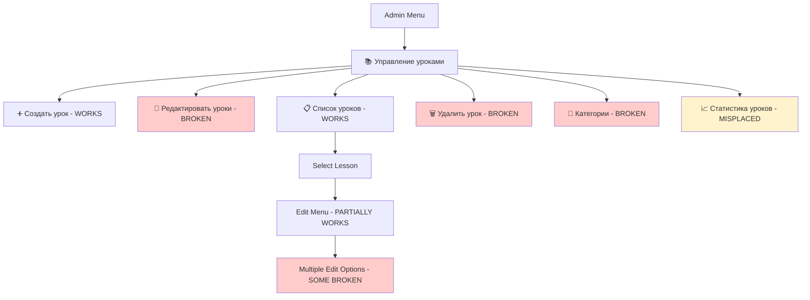
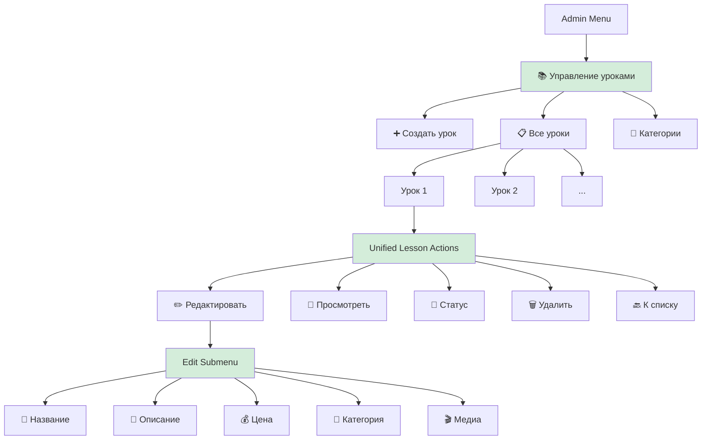

# Admin Panel Lesson Management Fix

## Overview

This design document addresses critical issues in the LearningBot admin panel lesson management system that prevent administrators from effectively managing lessons. The current implementation has broken handlers, fragmented user interface, and missing functionality that renders the lesson management system largely unusable.

### Current Issues Identified

1. **Missing Core Handlers**: Several callback handlers referenced in keyboards are not implemented
2. **Broken Navigation Flow**: Users cannot navigate effectively between lesson management screens
3. **Fragmented Interface**: Lesson management functions are scattered across multiple menus
4. **Non-functional CRUD Operations**: Create, edit, and delete operations fail due to missing handlers
5. **UI Inconsistencies**: Buttons lead to non-existent handlers causing system errors
6. **Statistics Button Misplacement**: Lesson statistics button appears in wrong menu location

### Design Goals

- Implement all missing callback handlers for complete functionality
- Consolidate lesson management into a unified, intuitive interface
- Fix broken navigation flows and state management
- Remove misplaced UI elements and improve user experience
- Add comprehensive testing to ensure reliability
- Maintain MVP scope constraints while fixing core functionality

## Architecture

### Current Lesson Management Flow Issues


```mermaid
flowchart TD
    A[Admin Menu] --> B[📚 Управление уроками]
    B --> C[➕ Создать урок - WORKS]
    B --> D[📝 Редактировать уроки - BROKEN]
    B --> E[📋 Список уроков - WORKS]
    B --> F[🗑️ Удалить урок - BROKEN]
    B --> G[📁 Категории - BROKEN]
    B --> H[📈 Статистика уроков - MISPLACED]
    
    E --> I[Select Lesson] 
    I --> J[Edit Menu - PARTIALLY WORKS]
    J --> K[Multiple Edit Options - SOME BROKEN]
    
    style D fill:#ffcccb
    style F fill:#ffcccb
    style G fill:#ffcccb
    style H fill:#fff3cd
    style K fill:#ffcccb
```

### Proposed Unified Lesson Management Flow


```mermaid
flowchart TD
    A[Admin Menu] --> B[📚 Управление уроками]
    B --> C[➕ Создать урок]
    B --> D[📋 Все уроки]
    B --> E[📁 Категории]
    
    D --> F[Урок 1] 
    D --> G[Урок 2]
    D --> H[...]
    
    F --> I[Unified Lesson Actions]
    I --> J[✏️ Редактировать]
    I --> K[👀 Просмотреть]
    I --> L[🔄 Статус]
    I --> M[🗑️ Удалить]
    I --> N[🔙 К списку]
    
    J --> O[Edit Submenu]
    O --> P[📝 Название]
    O --> Q[📄 Описание]
    O --> R[💰 Цена]
    O --> S[📁 Категория]
    O --> T[🎬 Медиа]
    
    style B fill:#d4edda
    style I fill:#d4edda
    style O fill:#d4edda
```

## API Endpoints Reference (Callback Handlers)

### Missing Handlers to Implement

#### 1. Edit Lessons Menu Handler
```python
@router.callback_query(F.data == "admin_edit_lessons")
async def show_edit_lessons_menu(callback: CallbackQuery, session: AsyncSession)
```
**Purpose**: Display list of lessons for editing selection
**Response**: Lesson list with edit buttons

#### 2. Delete Lesson Handler
```python
@router.callback_query(F.data == "admin_delete_lesson")
async def show_delete_lessons_menu(callback: CallbackQuery, session: AsyncSession)
```
**Purpose**: Display list of lessons for deletion selection
**Response**: Lesson list with delete confirmation

#### 3. Categories Management Handler
```python
@router.callback_query(F.data == "admin_categories")
async def show_categories_menu(callback: CallbackQuery, session: AsyncSession)
```
**Purpose**: Display category management interface
**Response**: Category list with CRUD options

#### 4. Edit Lesson Category Handler
```python
@router.callback_query(F.data.startswith("edit_lesson_category:"))
async def edit_lesson_category(callback: CallbackQuery, session: AsyncSession, state: FSMContext)
```
**Purpose**: Edit specific lesson category
**Response**: Category selection interface

#### 5. Additional Missing Handlers
- `edit_lesson_media:` - Edit lesson media content
- `edit_lesson_duration:` - Edit lesson duration
- `admin_preview_lesson:` - Preview lesson content
- `admin_confirm_delete:` - Confirm lesson deletion

### Handler Implementation Patterns

#### Error Handling Pattern
```python
try:
    # Handler logic
    await callback.answer()
except (ValueError, IndexError):
    await callback.answer("❌ Некорректные данные")
except Exception as e:
    logger.error(f"Ошибка в обработчике: {e}")
    await callback.answer("❌ Произошла ошибка")
```

#### Safe Message Access Pattern
```python
if callback.message and not isinstance(callback.message, InaccessibleMessage):
    await callback.message.edit_text(text, reply_markup=keyboard)
else:
    await callback.answer("❌ Сообщение недоступно")
```

## Data Models & ORM Mapping

### Current Lesson Model Support
The existing `Lesson` model supports all required fields:
- `title`, `description`, `price_stars`, `category`
- `content_type`, `file_id`, `duration`
- `is_active`, `is_free`, `views_count`
- `created_at`, `updated_at`

### Category Management
Categories are stored as string fields in lessons. For enhanced category management, consider:
- Dynamic category listing from existing lessons
- Category validation and standardization
- Category-based filtering and organization

## Business Logic Layer

### LessonService Enhancements

#### 1. Category Management Methods
```python
async def get_all_categories(self) -> List[str]
async def get_lessons_by_category(self, category: str) -> List[Lesson]
async def update_lesson_category(self, lesson_id: int, category: str) -> bool
```

#### 2. Enhanced CRUD Operations
```python
async def delete_lesson(self, lesson_id: int) -> bool
async def update_lesson_media(self, lesson_id: int, file_id: str, content_type: str) -> bool
async def update_lesson_duration(self, lesson_id: int, duration: int) -> bool
```

#### 3. Validation Methods
```python
async def validate_lesson_data(self, lesson_data: dict) -> Tuple[bool, str]
async def check_lesson_dependencies(self, lesson_id: int) -> List[str]
```

### AdminService Integration
Ensure proper admin permission checking for all lesson management operations:
```python
async def check_admin_permissions(self, admin_id: int, action: str) -> bool
```

## Keyboard Interface Improvements

### 1. Remove Lesson Statistics from Management Menu
Update `lessons_management_keyboard()` to remove misplaced statistics button:

```python
def lessons_management_keyboard() -> InlineKeyboardMarkup:
    keyboard = InlineKeyboardBuilder()
    
    keyboard.row(
        InlineKeyboardButton(text="➕ Создать урок", callback_data="admin_create_lesson"),
        InlineKeyboardButton(text="📋 Все уроки", callback_data="admin_lessons_list")
    )
    keyboard.row(
        InlineKeyboardButton(text="📁 Категории", callback_data="admin_categories"),
        InlineKeyboardButton(text="🗑️ Удалить урок", callback_data="admin_delete_lesson")
    )
    keyboard.row(
        InlineKeyboardButton(text="🔙 Назад", callback_data="admin_menu")
    )
    # REMOVED: Статистика уроков button (moved to main statistics menu)
    
    return keyboard.as_markup()
```

### 2. Enhanced Lesson Edit Keyboard
Improve lesson edit interface with better organization:

```python
def lesson_edit_keyboard(lesson_id: int) -> InlineKeyboardMarkup:
    keyboard = InlineKeyboardBuilder()
    
    # Content editing
    keyboard.row(
        InlineKeyboardButton(text="✏️ Название", callback_data=f"edit_lesson_title:{lesson_id}"),
        InlineKeyboardButton(text="📝 Описание", callback_data=f"edit_lesson_description:{lesson_id}")
    )
    
    # Metadata editing
    keyboard.row(
        InlineKeyboardButton(text="💰 Цена", callback_data=f"edit_lesson_price:{lesson_id}"),
        InlineKeyboardButton(text="📁 Категория", callback_data=f"edit_lesson_category:{lesson_id}")
    )
    
    # Media and settings
    keyboard.row(
        InlineKeyboardButton(text="🎬 Медиа", callback_data=f"edit_lesson_media:{lesson_id}"),
        InlineKeyboardButton(text="⏱️ Длительность", callback_data=f"edit_lesson_duration:{lesson_id}")
    )
    
    # Status controls
    keyboard.row(
        InlineKeyboardButton(text="🔄 Статус", callback_data=f"toggle_lesson_status:{lesson_id}"),
        InlineKeyboardButton(text="🎁 Бесплатный", callback_data=f"toggle_lesson_free:{lesson_id}")
    )
    
    # Actions
    keyboard.row(
        InlineKeyboardButton(text="👀 Просмотреть", callback_data=f"admin_preview_lesson:{lesson_id}"),
        InlineKeyboardButton(text="🗑️ Удалить", callback_data=f"admin_confirm_delete:{lesson_id}")
    )
    
    # Navigation
    keyboard.row(
        InlineKeyboardButton(text="🔙 К списку уроков", callback_data="admin_lessons_list")
    )
    
    return keyboard.as_markup()
```

### 3. Category Management Keyboard
```python
def categories_management_keyboard(categories: List[str]) -> InlineKeyboardMarkup:
    keyboard = InlineKeyboardBuilder()
    
    # Category list
    for category in categories:
        keyboard.row(
            InlineKeyboardButton(
                text=f"📁 {category}", 
                callback_data=f"admin_category_details:{category}"
            )
        )
    
    # Actions
    keyboard.row(
        InlineKeyboardButton(text="➕ Новая категория", callback_data="admin_create_category"),
        InlineKeyboardButton(text="🔙 Назад", callback_data="admin_lessons")
    )
    
    return keyboard.as_markup()
```

## State Management Enhancements

### Additional FSM States Required

```python
class LessonManagementStates(StatesGroup):
    # Existing states...
    
    # Category management
    creating_category = State()
    editing_category = State()
    deleting_category = State()
    
    # Media editing
    editing_lesson_media = State()
    uploading_new_media = State()
    
    # Enhanced editing
    editing_lesson_duration = State()
    
    # Deletion workflow
    selecting_lesson_to_delete = State()
    confirming_deletion = State()
```

## Testing Strategy

### 1. Unit Tests for Missing Handlers
```python
# tests/test_admin_lesson_handlers.py
async def test_show_edit_lessons_menu():
    # Test edit lessons menu display
    
async def test_show_delete_lessons_menu():
    # Test delete lessons menu display
    
async def test_categories_management():
    # Test category management interface
    
async def test_edit_lesson_category():
    # Test category editing functionality
```

### 2. Integration Tests for Complete Flows
```python
# tests/test_lesson_management_integration.py
async def test_complete_lesson_creation_flow():
    # Test full lesson creation process
    
async def test_complete_lesson_editing_flow():
    # Test full lesson editing process
    
async def test_lesson_deletion_flow():
    # Test lesson deletion with confirmation
    
async def test_category_management_flow():
    # Test category CRUD operations
```

### 3. UI Flow Tests
``python
# tests/test_lesson_ui_flow.py
async def test_navigation_consistency():
    # Test all navigation paths work correctly
    
async def test_keyboard_callbacks():
    # Test all keyboard buttons have working handlers
    
async def test_error_handling():
    # Test error scenarios and user feedback
```

### 4. Test Fixtures Enhancement
```python
@pytest.fixture
async def sample_lessons_with_categories():
    """Create sample lessons with various categories for testing"""
    
@pytest.fixture  
async def admin_session():
    """Authenticated admin session for testing admin operations"""
```

## Implementation Priority

### Phase 1: Critical Missing Handlers (High Priority)
1. Implement `admin_edit_lessons` handler
2. Implement `admin_delete_lesson` handler  
3. Implement `admin_categories` handler
4. Fix `edit_lesson_category` handler

### Phase 2: Enhanced Functionality (Medium Priority)
1. Implement media editing handlers
2. Implement duration editing handlers
3. Implement lesson preview functionality
4. Add category management CRUD operations

### Phase 3: UI/UX Improvements (Medium Priority)
1. Remove lesson statistics button from management menu
2. Improve keyboard layouts and organization
3. Add better error messages and user feedback
4. Enhance navigation flow consistency

### Phase 4: Testing & Validation (High Priority)
1. Add comprehensive unit tests for all handlers
2. Add integration tests for complete workflows
3. Add UI flow tests for navigation
4. Perform end-to-end testing of lesson management

## Error Handling & Validation

### Input Validation
- Validate lesson IDs before operations
- Check admin permissions for all operations
- Validate file uploads and media types
- Sanitize user input for categories and descriptions

### Error Response Patterns
- Consistent error messages for user feedback
- Proper logging for debugging
- Graceful degradation when services unavailable
- Clear instructions for error recovery

### State Recovery
- Clear FSM states on errors
- Provide navigation back to safe menus
- Handle interrupted workflows gracefully
- Maintain data consistency during failures
