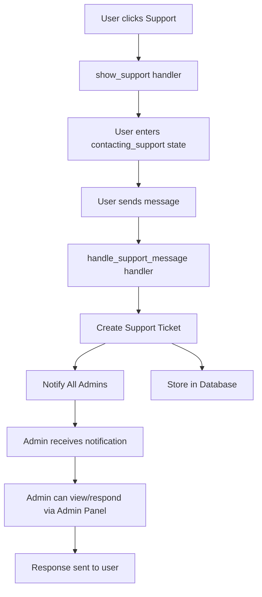
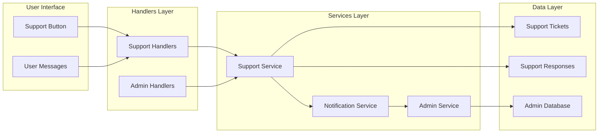
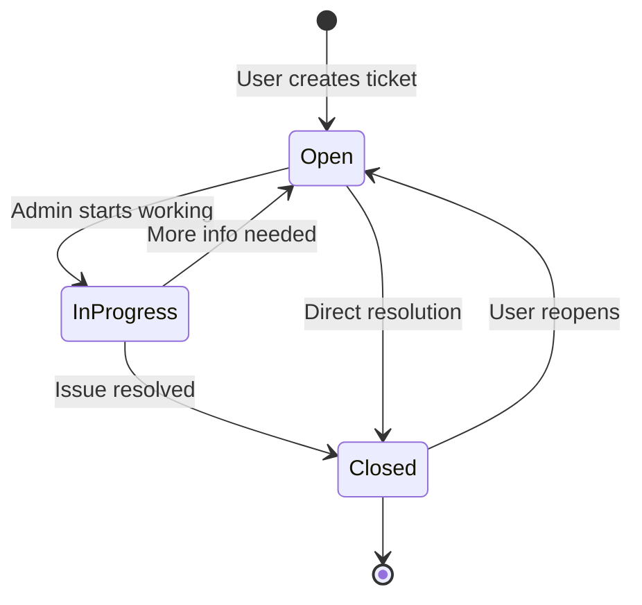

# Support Button Functionality Testing & Implementation

## Overview

This document outlines the testing strategy and implementation plan for the support button functionality in the LearningBot Telegram bot. The current implementation provides basic user support request collection but lacks a complete admin notification and response system.

### Current State Analysis

**Implemented Features:**
- ✅ Support button in main menu (`keyboards/user.py`)
- ✅ Support request handler (`handlers/user/start.py:show_support`)
- ✅ Message collection handler (`handlers/user/start.py:handle_support_message`)  
- ✅ User state management (`states/user.py:UserStates.contacting_support`)
- ✅ Basic user feedback and state clearing

**Missing Features:**
- ❌ Admin notification system when support requests are submitted
- ❌ Admin interface for viewing and managing support tickets
- ❌ Support ticket persistence and tracking
- ❌ Two-way communication between users and support staff
- ❌ Support ticket status management (open/in-progress/closed)

## Architecture

### Support System Integration



### Component Architecture



## API Endpoints Reference

### User Support Handlers

#### `show_support` Handler
- **Route:** `callback_query(F.data == "support")`
- **Purpose:** Initialize support request interface
- **State:** Sets `UserStates.contacting_support`
- **Response:** Support message template with cancel option

#### `handle_support_message` Handler  
- **Route:** `message(UserStates.contacting_support)`
- **Purpose:** Process user support message
- **Current Implementation:** Logs message, sends confirmation
- **Required Enhancement:** Create ticket and notify admins

### Admin Support Handlers (To Implement)

#### `show_support_tickets` Handler
- **Route:** `callback_query(F.data == "admin_support")`
- **Purpose:** Display list of support tickets
- **Response:** Paginated ticket list with status indicators

#### `view_support_ticket` Handler
- **Route:** `callback_query(F.data.startswith("ticket:"))`
- **Purpose:** Display individual ticket details
- **Response:** Full conversation history and response options

#### `respond_to_ticket` Handler
- **Route:** `message(AdminStates.responding_to_support)`
- **Purpose:** Send response to user via ticket system
- **Response:** Confirmation and ticket status update

## Data Models & ORM Mapping

### Support Ticket Model (To Implement)

```python
class SupportTicket(Base):
    """Model for support requests and tickets"""
    __tablename__ = 'support_tickets'
    
    id: Mapped[int] = mapped_column(Integer, primary_key=True)
    user_id: Mapped[int] = mapped_column(BigInteger, ForeignKey('users.user_id'), nullable=False)
    ticket_number: Mapped[str] = mapped_column(String(20), unique=True, nullable=False)
    subject: Mapped[str] = mapped_column(String(255), default="Support Request")
    initial_message: Mapped[str] = mapped_column(Text, nullable=False)
    status: Mapped[str] = mapped_column(String(20), default="open")  # open, in_progress, closed
    priority: Mapped[str] = mapped_column(String(10), default="normal")  # low, normal, high, urgent
    assigned_admin_id: Mapped[Optional[int]] = mapped_column(BigInteger, ForeignKey('admins.user_id'), nullable=True)
    created_at: Mapped[datetime] = mapped_column(DateTime, default=lambda: datetime.now(timezone.utc))
    updated_at: Mapped[datetime] = mapped_column(DateTime, onupdate=lambda: datetime.now(timezone.utc))
    closed_at: Mapped[Optional[datetime]] = mapped_column(DateTime, nullable=True)
    
    # Relationships
    user: Mapped["User"] = relationship("User")
    assigned_admin: Mapped[Optional["Admin"]] = relationship("Admin")
    responses: Mapped[List["SupportResponse"]] = relationship("SupportResponse", back_populates="ticket")
```

### Support Response Model (To Implement)

```python
class SupportResponse(Base):
    """Model for responses in support tickets"""
    __tablename__ = 'support_responses'
    
    id: Mapped[int] = mapped_column(Integer, primary_key=True)
    ticket_id: Mapped[int] = mapped_column(Integer, ForeignKey('support_tickets.id'), nullable=False)
    sender_type: Mapped[str] = mapped_column(String(10), nullable=False)  # user, admin
    sender_id: Mapped[int] = mapped_column(BigInteger, nullable=False)  # Telegram user_id
    message: Mapped[str] = mapped_column(Text, nullable=False)
    is_internal: Mapped[bool] = mapped_column(Boolean, default=False)  # Internal admin notes
    created_at: Mapped[datetime] = mapped_column(DateTime, default=lambda: datetime.now(timezone.utc))
    
    # Relationships
    ticket: Mapped["SupportTicket"] = relationship("SupportTicket", back_populates="responses")
```

## Business Logic Layer

### Support Service Architecture

#### SupportService Class

```python
class SupportService:
    """Service for managing support tickets and responses"""
    
    async def create_support_ticket(
        self, 
        user_id: int, 
        message: str, 
        priority: str = "normal"
    ) -> Optional[SupportTicket]:
        """Create new support ticket and notify admins"""
        
    async def get_user_tickets(
        self, 
        user_id: int, 
        status: Optional[str] = None
    ) -> List[SupportTicket]:
        """Get all tickets for a specific user"""
        
    async def get_admin_tickets(
        self, 
        admin_id: Optional[int] = None,
        status: Optional[str] = None,
        limit: int = 20
    ) -> List[SupportTicket]:
        """Get tickets for admin management interface"""
        
    async def add_response(
        self,
        ticket_id: int,
        sender_id: int,
        message: str,
        sender_type: str = "admin",
        is_internal: bool = False
    ) -> Optional[SupportResponse]:
        """Add response to existing ticket"""
        
    async def update_ticket_status(
        self,
        ticket_id: int,
        status: str,
        admin_id: Optional[int] = None
    ) -> bool:
        """Update ticket status and assignment"""
```

### Admin Notification System

#### NotificationService Integration

```python
class NotificationService:
    """Service for sending notifications to admins"""
    
    async def notify_admins_of_support_request(
        self, 
        ticket: SupportTicket
    ) -> bool:
        """Send immediate notification to all active admins"""
        
        # Get all active admins
        admins = await self.admin_service.get_all_admins()
        active_admins = [admin for admin in admins if admin.is_active]
        
        # Prepare notification message
        notification_message = f"""
🆘 <b>New Support Request #{ticket.ticket_number}</b>

👤 <b>User:</b> {ticket.user.full_name}
🆔 <b>ID:</b> <code>{ticket.user_id}</code>
📱 <b>Username:</b> @{ticket.user.username or 'None'}

💬 <b>Message:</b>
{ticket.initial_message}

🕒 <b>Created:</b> {ticket.created_at.strftime('%d.%m.%Y %H:%M')}

Use /admin to manage support tickets.
"""
        
        # Send to all admins
        success_count = 0
        for admin in active_admins:
            try:
                await self.bot.send_message(
                    chat_id=admin.user_id,
                    text=notification_message,
                    parse_mode="HTML"
                )
                success_count += 1
            except Exception as e:
                logger.error(f"Failed to notify admin {admin.user_id}: {e}")
        
        return success_count > 0
```

### Support Workflow Logic

#### Ticket Lifecycle Management



#### Response Flow Logic

1. **User submits request** → Create ticket → Notify admins
2. **Admin views ticket** → Change status to "in_progress" → Assign to self
3. **Admin responds** → Add response → Send message to user → Update timestamp
4. **User replies** → Add response to same ticket → Notify assigned admin
5. **Resolution** → Admin closes ticket → Send confirmation to user

## Middleware & Interceptors

### Admin Authorization Middleware

Support ticket management requires admin authentication:

```python
@router.callback_query(F.data == "admin_support")
@admin_required  # Existing admin middleware
async def show_support_tickets(callback: CallbackQuery, session: AsyncSession):
    """Display support tickets dashboard"""
```

### State Management Integration

New admin states for support management:

```python
class AdminStates(StatesGroup):
    # Existing states...
    viewing_support_tickets = State()
    responding_to_support = State()
    managing_ticket = State()
```

## Testing

### Unit Test Coverage

#### Test Support Ticket Creation

```python
async def test_create_support_ticket(support_service, sample_user):
    """Test creating a new support ticket"""
    message = "I can't access my purchased lesson"
    
    ticket = await support_service.create_support_ticket(
        user_id=sample_user.user_id,
        message=message,
        priority="normal"
    )
    
    assert ticket is not None
    assert ticket.initial_message == message
    assert ticket.status == "open"
    assert ticket.ticket_number.startswith("TK")
    assert len(ticket.ticket_number) == 8  # TK + 6 digits
```

#### Test Admin Notification

```python
async def test_admin_notification_on_ticket_creation(
    support_service, 
    sample_user, 
    sample_admin,
    mock_bot
):
    """Test that admins receive notifications for new tickets"""
    
    with patch('services.support.NotificationService') as mock_notification:
        mock_notification.return_value.notify_admins_of_support_request.return_value = True
        
        ticket = await support_service.create_support_ticket(
            user_id=sample_user.user_id,
            message="Test support request"
        )
        
        # Verify notification was attempted
        mock_notification.return_value.notify_admins_of_support_request.assert_called_once_with(ticket)
```

### Integration Test Scenarios

#### Test Complete Support Flow

```python
async def test_complete_support_flow(
    client, 
    sample_user, 
    sample_admin, 
    db_session
):
    """Test end-to-end support request flow"""
    
    # 1. User clicks support button
    response = await client.post("/webhook", json={
        "callback_query": {
            "id": "test_callback",
            "from": {"id": sample_user.user_id},
            "data": "support"
        }
    })
    assert response.status_code == 200
    
    # 2. User sends support message
    response = await client.post("/webhook", json={
        "message": {
            "message_id": 123,
            "from": {"id": sample_user.user_id},
            "text": "I need help with payment",
            "date": int(time.time())
        }
    })
    assert response.status_code == 200
    
    # 3. Verify ticket was created
    tickets = await SupportService(db_session).get_user_tickets(sample_user.user_id)
    assert len(tickets) == 1
    assert tickets[0].initial_message == "I need help with payment"
    
    # 4. Admin views tickets (would be separate test for admin interface)
```

#### Test Error Scenarios

```python
async def test_support_without_text_message():
    """Test handling non-text messages in support state"""
    
async def test_support_with_empty_message():
    """Test handling empty support messages"""
    
async def test_admin_notification_failure():
    """Test handling when admin notification fails"""
    
async def test_ticket_creation_database_error():
    """Test handling database errors during ticket creation"""
```

### Performance Testing

#### Load Testing Support System

- Test concurrent support requests
- Verify admin notification performance with multiple admins
- Test ticket retrieval with large datasets
- Validate database performance with high ticket volumes

### User Acceptance Testing

#### Test Scenarios

1. **User Experience Flow**
   - User can easily find and click support button
   - Support interface is clear and intuitive
   - User receives confirmation of request submission
   - User can see status updates if implemented

2. **Admin Experience Flow**
   - Admins receive timely notifications
   - Admin interface allows easy ticket management
   - Response system works correctly
   - Ticket status tracking is accurate

3. **Edge Cases**
   - Very long support messages
   - Special characters and emojis
   - Multiple rapid requests from same user
   - System behavior when no admins are active

### Manual Testing Checklist

#### User Interface Testing
- [ ] Support button visible in main menu
- [ ] Support button triggers correct handler
- [ ] Support message interface displays correctly
- [ ] Cancel button returns to main menu
- [ ] User receives confirmation after sending message
- [ ] State management works correctly

#### Admin Interface Testing
- [ ] Admin can access support tickets dashboard
- [ ] Tickets display with correct information
- [ ] Admin can view individual ticket details
- [ ] Admin can respond to tickets
- [ ] Ticket status updates correctly
- [ ] Admin notifications work properly

#### Integration Testing
- [ ] Support service integrates with user service
- [ ] Admin service integration works
- [ ] Database operations succeed
- [ ] Error handling prevents crashes
- [ ] Logging captures necessary information

#### Performance Testing
- [ ] Response times are acceptable
- [ ] System handles multiple concurrent requests
- [ ] Memory usage remains stable
- [ ] Database queries are optimized
